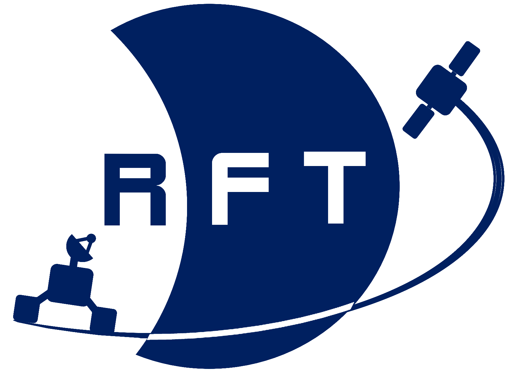

<a name="readme-top"></a>
<!-- PROJECT LOGO -->
<div align="center">
  <a href="https://www.tu.berlin/raumfahrttechnik">
    
  </a>
  <a href="https://www.tu.berlin/">
    
  </a>
  
  <h3 align="center">Physics Informed Inter-Satellite Communication Threat Detection</h3>

  <p align="center">
    <a href="https://www.tu.berlin/raumfahrttechnik/forschung/aktuelle-projekte/raccoon"><strong>[RACCOON PROJECT]</strong></a>
    <br />
    <br />
  </p>
</div>

## About the Project

The project allows the user to simulate satellites based on the two-line elements provided, e.g., [here](https://celestrak.org/). The main task of the program is to detect inter-satellite communication, which should help determine the type of communication. 

## Installation
The program is written in Python in a Jupyter Notebook shell. To run the code, you need a current version of Python (3.11.8) and Jupyter Notebook. It is a good idea to use an IDE such as [Spyder](https://www.spyder-ide.org/) or [VS Code](https://code.visualstudio.com/). To run the code, you must first install the Git repository. If you have access rights, you can accomplish this by using the following command:
```bash
pip install git+https://git.tu-berlin.de/raccoon/student-projects/physics-informed-threat-detection.git
```
After successfully installing the repository, you need to install all the libraries being used. You can do this using pip and the requirments.txt file, as shown in the example below.
```bash
pip install -r requirements.txt
```

## Usage
Two-line elements must be provided from at least two examined satellites in order to run the code. They have to be stored with the following convention inside the `sat_data.txt`. 
```txt
SALSAT                  
1 46495U 20068K   24030.81772614  .00007730  00000-0  46931-3 0  9992
2 46495  97.8001 347.0570 0016345  68.2037 292.0929 15.10690034183404
BEESAT 9
1 44412U 19038AC  24031.50273885  .00065440  00000-0  11625-2 0  9990
2 44412  97.6870  27.7373 0009756 183.0510 177.0683 15.49924590253255
[...]
```
To use the full potential of the 'Future Attack' file, a shapefile (.shp) of a world map must be defined. This shapefile should indicate the areas where the attacking satellite signal is allowed. 
## Support
For questions write <k.mai@campus.tu-berlin.de>.  

## Roadmap
- [x] Add position determinition
    - [x] Add plot 
    - [x] Add relative velocity
    - [x] Add Earth
        - [x] Add line of sight
    - [x] Add orientation case of antenna 
        - [x] Add antenna lobe
        - [x] Add longitude. latitude of antenna lobe
    - [x] Add longitude, latitude of satellite 
    - [x] Add threatarea for antenna signal
      - [x] Accept EPSG:4326 as input (lon,lat)
      - [x] Accept ESRI:53042 as input (x,y)
    - [x] Add multiple access detection
- [x] Add threshold past attack
- [x] Add threshold future attack 

## License
See `LICENSE.txt` for more information.

## Documentation
The program is documented with Sphinx. 

<p align="right"> (<a href="#readme-top">back to top</a>) </p>